# QT_Test

【[**Return to Repositories**](https://github.com/FDUJiaG/QT_Test)】

本测试旨在重现一套比较简单且完备的量化框架

该框架基于现代投资组合理论，并应用主流的机器学习算法（SVM）进行分析

旨在初步形成一个量化投资的思路，辅助构建科学合理的投资策略

## Anticipate Process

### Preparation

- [SQL Queries](https://github.com/FDUJiaG/QT_Test/tree/master/sqlQueries)
- [Initial Capital](https://github.com/FDUJiaG/QT_Test/blob/master/sqlQueries/my_capital.sql) of Loopback Test (optional, default = 1 M)

### Input

- Stock Pool
- Base Stock Index
- Interval of Loopback Test
- Windows of Preproession (optional, default = 365)
- Windows of Loopback Trainning Test (optional, default = 90)
- Windows of Loopack Portfolio (optional, default = year)
- Change Frequency of Portfolio (optional, default =5)

### Main Program

```shell
$ python Init_StockALL_Sp.py
$ python stock_index_pro.py
$ python main_pro.py
```

### Output

- Daily Trading Data in [Stock Pool](https://github.com/FDUJiaG/QT_Test/blob/master/sqlT_to_csv/stock_all.csv) and [Base Index](https://github.com/FDUJiaG/QT_Test/blob/master/sqlT_to_csv/stock_index_pro.csv)
- [Result](https://github.com/FDUJiaG/QT_Test/blob/master/sqlT_to_csv/model_ev_resu.csv) of SVM Model Evaluation
- The [Capital Situation](https://github.com/FDUJiaG/QT_Test/blob/master/sqlT_to_csv/my_capital.csv) during Loopback Test
- The [Stocks Holding](https://github.com/FDUJiaG/QT_Test/blob/master/sqlT_to_csv/my_stock_pool.csv) in Last Loopback Test Day
- [Effect Index](https://github.com/FDUJiaG/QT_Test/blob/master/imag/LoopBack.png) of Quantization
- <a href="###Return，Withdrawal的可视化">Visualization</a> of Return and Withdrawal

## Dependencies

测试使用的Python版本：3.6.8

测试使用的Anaconda版本：1.9.6

### Installation or Upgrade for Tushare

```shell
$ pip install tushare
$ pip install tushare --upgrade
```

### Import Tushare

```python
import tushare as ts
```

tushare版本需大于1.2.10

### Set Token

```python
ts.set_token('your token')
```

完成调取tushare数据凭证的设置，通常只需要设置一次

### Initialize Pro API

```python
pro = ts.pro_api()
# 或者在初始化中直接设置token
pro = ts.pro_api('your token')
```

### Main Data API

```python
pro.daily()       # 获取日K数据（未赋权）
pro.index_daily() # 获取指数行情
pro.trade_cal()   # 获取交易日历
```

### Package

#### Time Handle

```python
import datetime
```

#### MySql Handle

```python
import pymysql.cursors
import sqlalchemy
```

#### Data Handle

```python
import numpy as np
import pandas as pd
from sklearn import svm
import pylab as *
import math
```

## 设计过程

### 数据采集预处理后建模

- 基于[Tushare](https://tushare.pro/document/1?doc_id=131)进行交易数据采集（[股票](https://github.com/FDUJiaG/QT_Test/blob/master/codes/Init_StockALL_Sp.py)，[指数](https://github.com/FDUJiaG/QT_Test/blob/master/codes/stock_index_pro.py)）
- 简单[数据预处理](https://github.com/FDUJiaG/QT_Test/blob/master/codes/DC.py)，生成训练集
- 利用[SVM](https://blog.csdn.net/b285795298/article/details/81977271)算法进行[建模](https://github.com/FDUJiaG/QT_Test/blob/master/codes/Model_Evaluate.py)，并[预测涨跌](https://github.com/FDUJiaG/QT_Test/blob/master/codes/SVM.py)情况，准备开发择时策略

### 模型评估和仓位管理

- 测试区间内[评估指标](####SVM模型评价)的[计算](https://github.com/FDUJiaG/QT_Test/blob/master/codes/Model_Evaluate.py)，包括：Precision，Recall，F1，Negative_Accuracy等值
-  基于[马科维茨理论](https://mp.weixin.qq.com/s/neCSaWK0c4jzWwCfDVFA6A)的[仓位管理](https://github.com/FDUJiaG/QT_Test/blob/master/codes/Portfolio.py)分配，取**次最小的特征值和特征向量**（最佳收益方向）

### 模拟交易测试及回测

- 模拟交易，包括：获取资金账户[数据](https://github.com/FDUJiaG/QT_Test/blob/master/codes/Deal.py)，执行买卖[操作](https://github.com/FDUJiaG/QT_Test/blob/master/codes/Operator.py)，更新持仓天数及买卖[逻辑](https://github.com/FDUJiaG/QT_Test/blob/master/codes/Filter.py)，更新资产表[数据](https://github.com/FDUJiaG/QT_Test/blob/master/codes/Cap_Update_daily.py)等
- 策略框架下，进行[回测](https://github.com/FDUJiaG/QT_Test/blob/master/codes/main_pro.py)并计时（[回测过程](###回测)图示）
- 计算并返回量化策略[评估指标](####输出评价)：Return，Withdrawal，Sharp，Risk，IR及Tracking Error等
- 对于Return，Withdrawal的[可视化展示](###Return，Withdrawal的可视化)

## 详细示例
### 获取数据并存储
#### 股票行情

**数据获取**

默认获取从预设时间（我们定义为$2010$年第$1$个交易日）到最邻近交易日，股票池所有交易日的行情数据

注意更改[Init_StockALL_Sp.py](https://github.com/FDUJiaG/QT_Test/blob/master/codes/Init_StockALL_Sp.py)中的股票池

```python
# 设定需要获取数据的股票池, 比如与云计算、软件板块相关的标的
# 中兴通讯, 远光软件, 中国长城, 东方财富, 用友网络, 中科曙光, 中国软件, 浪潮信息, 宝信软件
stock_pool = ['000063.SZ', '002063.SZ', '000066.SZ', '300059.SZ', '600588.SH', '603019.SH', '600536.SH', '000977.SZ', '600845.SH']
```

如果对于股票代码，所属板块，上市状态，上市日期等情况不甚了解，可以优先查询股票的[基本信息](https://tushare.pro/document/2?doc_id=25)

 ```python
# 获取股票基本信息列表
data = pro.stock_basic()
 ```

 <p align="left">

 

**存储至MySQL**

部分示例 <p align="left">

 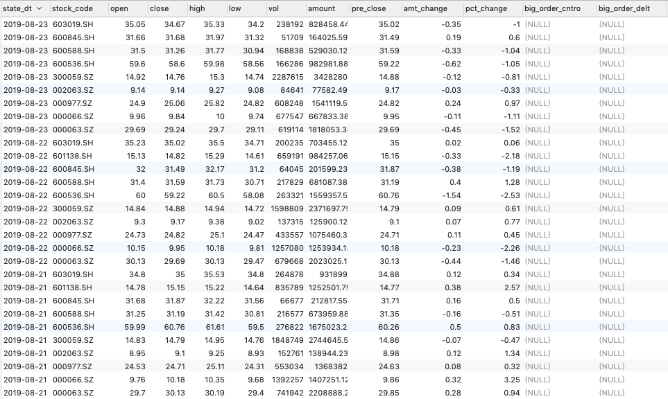

**注意**

对于使用[main_pro.py](https://github.com/FDUJiaG/QT_Test/blob/master/codes/main_pro.py)正式回测时，我们选择的股票池必须是前述Init_StockALL_Sp.py中股票的子集，且为了后续构建资产组合中$Eig$不至于过少，规定股票池的度不小于$5$

由于我们在分析不同问题时，从Init_StockALL_Sp.py中获取标的的数量较为庞大（比如超过$1000$只股票），但在回测中标的股票数不可能过于庞大（算力限制，一段时间内主成分也不会过多），比如我们在main_pro.py中的股票池标的数就选为最小的$5$，在[stock_info](https://github.com/FDUJiaG/QT_Test/blob/master/sqlT_to_csv/stock_info.csv)表中会优先精简上述的[stock_all](https://github.com/FDUJiaG/QT_Test/blob/master/sqlT_to_csv/stock_all.csv)表，既相当于从自己获取的数据库中，抓取回测所需股票池中的标的行情数据，这样会在一定程度上提高查询速度，示例不再赘述

#### 指数行情

**数据获取**

默认获取从预设时间（我们定义为$2010$年第$1$个交易日）到最邻近交易日，参考指数所有交易日的行情数据

注意更改[stock_index_pro.py](https://github.com/FDUJiaG/QT_Test/blob/master/codes/stock_index_pro.py)中的基准指数

| 指数名称 | 赋予简称 | 交易所/Tushare编码     |
| -------- | -------- | ---------------------- |
| 上证指数 | SH       | 000001.SH              |
| 深圳成指 | SZ       | 399001.SZ              |
| 上证50   | SH50     | 000016.SH              |
| 沪深300  | HS300    | 000300.SH or 399300.SZ |
| 中证500  | ZZ500    | 000905.SH or 399905.SZ |
| 中小板指 | ZX       | 399005.SZ              |
| 创业板   | CY       | 399006.SZ              |

因为股票池中后续进行回测的股票两市均有，且市值相对较重，所以选择沪深300指数较为合理

```python
df = pro.index_daily(ts_code='000300.SH')
# 统一指数标注并删除原复杂指数代码标注
df['stock_code'] = 'HS300'
```


 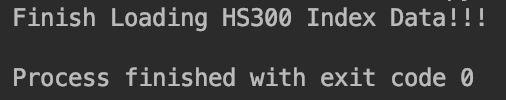

**存储至MySQL**

部分示例 <p align="left">

 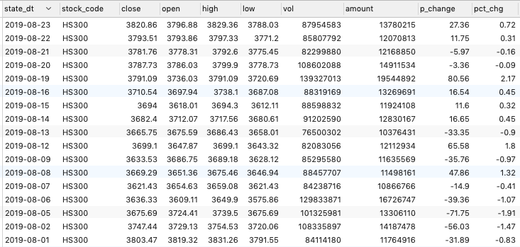

### 利用SVM建模

#### 单个SVM结果

从获取数据的特征，基于SVM做分类问题，来对于涨跌判断进行建模

```python
from sklearn import svm
import DC
# DC是将原始行情数据划分成SVM训练的各项数据集的预处理类

dc = DC.data_collect(stock, start_date, end_date)
train = dc.data_train           # 训练集
target = dc.data_target         # 目标集
test_case = [dc.test_case]      # 测试集
model = svm.SVC()               # 建模
model.fit(train, target)        # 训练
ans2 = model.predict(test_case) # 预测
```

**运行结果** <p align="left">

 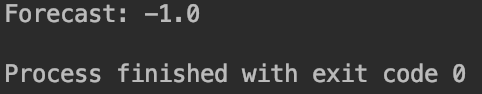

#### SVM模型评价

有了单个SVM结果后，就可以通过遍历股票池中的标的，并对比SVM训练时，测试区间中的真实情况给予评价

机器学习常用评价指标公式如下：

$Acc (Precision)= \frac{Tp(预测上涨且正确)}{Tp+Fp(预测上涨实际不上涨)}$

$Acc(Recall) = \frac{Tp}{Tp+Fn(预测不上涨但实际上涨)}$

$\begin{equation}
F1 =\begin{cases}
\begin{array}{cc}
0, & Precision*Recall=0 \\
\frac{2*Precision*Recall}{Precision + Recall}, & else
\end{array}
\end{cases}
\end{equation}$

$ACC\_Neg=\frac{Tn(预测为不上涨且正确)}{Tn+Fn(预测为不上涨但实际上涨)}$

部分效果如下 <p align="left">

 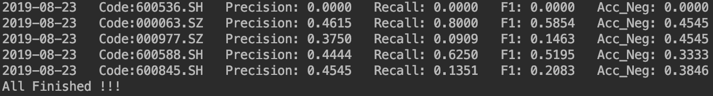

再遍历所有回测区间内的交易日，来给出全部的预测情况及评价指标


 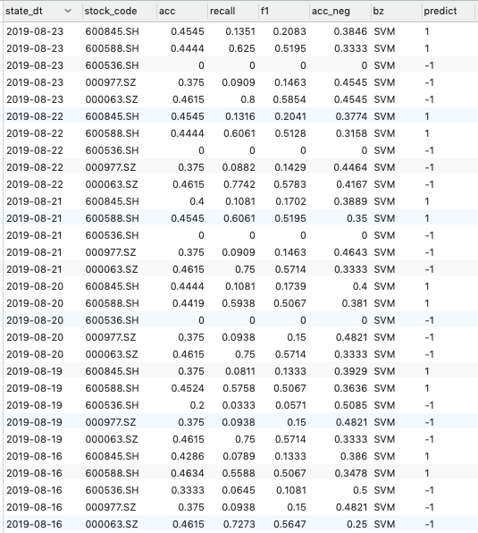

这里需要注意，在一些其他应用场景（比如医疗，身份识别）中，需要$F1$分值足够接近$1$，否则模型毫无意义。

并且在其他条件一定时，$F1$增大肯定不是坏事

但在投资领域，胜率并不能完全反应到收益，比如$90\%$的胜率也存在每次都赚了小钱，但在错误预判时却造成巨额亏损的情况，相反低胜率也存在每次收益较大而使得总收益期望大于$0$的情形

### 仓位管理

当然对于每一小段时间，我们还是需要从指标层面选择较强的标的来构建投资组合，这样在相同的收益率下，我们将承担更小的风险

区分于其他市场（美股等），A股市场没有有效的认沽机制，或者说做空条件过于严苛和高贵，所以我们不能将特征向量中的负值在策略中成为空头开仓，而是必须将其舍去（重置为$0$），并将特征向量中的正值线性归一化（理论上这一步会极大地降低收益），由于我们需要挖掘期望收益为正的策略，归一化可以增加我们的资金使用效率

**现代投资组合理论的主要实现如下：**

```python
# 求协方差矩阵
cov = np.cov(np.array(list_return).T)
# 求特征值和其对应的特征向量
ans = np.linalg.eig(cov)
# 排序，特征向量中负数置0，非负数线性归一
ans_index = copy.copy(ans[0])
ans_index.sort()
resu = []
for k in range(len(ans_index)):
    con_temp = []
    con_temp.append(ans_index[k])
    content_temp1 = ans[1][np.argwhere(ans[0] == ans_index[k])[0][0]]
    content_temp2 = []
    content_sum = np.array([x for x in content_temp1 if x >= 0.00]).sum()
    for m in range(len(content_temp1)):
        if content_temp1[m] >= 0 and content_sum > 0:
            content_temp2.append(content_temp1[m] / content_sum)
        else:
            content_temp2.append(0.00)
    con_temp.append(content_temp2)
```

对于某一交易日的仓位管理，可以将较长一段时间（回测时选取了$2019$，所以记得在第一步尽量剔除次新股）的return list传入上述代码来得到

在[Portfolio.py](https://github.com/FDUJiaG/QT_Test/blob/master/codes/Portfolio.py)中，可以返回最小和次小两套特征值和特征向量，分别对应在投资可行域中最小风险组合，以及最佳收益组合（风险稍稍提高，收益明显提高），如下图所示


 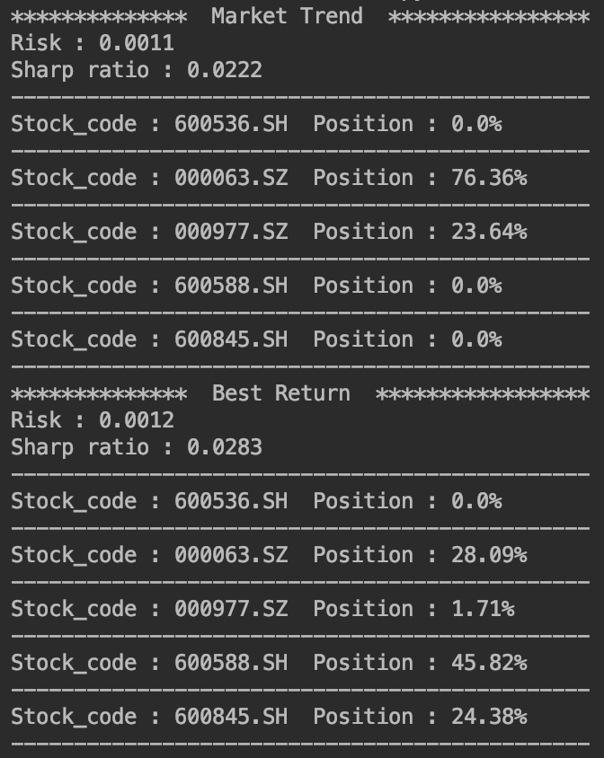

在正式的回测中，我们选取最佳收益组合来作为投资的仓位管理依据

### 回测

#### 回测准备

- 回测区间：$2019-07-24 → 2019-08-23$ (对于日K策略，回测区间小于一个月意义不大）

- 股票池为：中国软件, 中兴通讯, 浪潮信息, 用友网络, 宝信软件

  ```python
  stock_pool = ['600536.SH', '000063.SZ', '000977.SZ', '600588.SH', '600845.SH']
  ```

- 无风险利率：设为一年期银行存款，年化$1.5\%$
- 货币资金收益率：预设为年化$2.5\%$
- 其他参数：如前所述，或采取默认值
- 回测时我们根据收盘价进行交易（假设在资金量不大时一定可以成交到模型中计划的数量）

#### 回测过程

在已有的训练、建模、预测后，我们进行模拟交易，投资组合变换的频率默认为$5$个交易日

根据回测区间第一个交易日的行情，进行一次**投资组合建仓**（手续费$r_{Buy}=0.05\%$）

由于最小的交易单位是$100$股，我们会向下取$100$的倍数为第$i$支标的持仓股数$Position(Stock_i)$

并按照如下公式更新资产信息：

$Capital(Date)=Capital(Date-1)-r_{Buy}\cdot\sum\limits_{i=1}^NClose\_Buy(Stock_i,Date)\cdot Position(Stock_i)$

$Money\_Lock(Date)=Money\_Lock(Date-1)+\sum\limits_{i=1}^NClose\_{Buy}(Stock_i,Date)\cdot Position(Stock_i)$

$Money\_Rest(Date)=Money\_Rest(Date-1)-(1+r_{Buy})\cdot\sum\limits_{i=1}^NClose\_{Buy}(Stock_i,Date)\cdot Position(Stock_i)$

```python
new_capital = deal_buy.cur_capital - vol * buy_price * 0.0005
new_money_lock = deal_buy.cur_money_lock + vol * buy_price
new_money_rest = deal_buy.cur_money_rest - vol * buy_price * 1.0005
```

随后制定平仓（$r_{Sell}=0.16\%$，如果在一个投资组合内，某标的被策略卖出，则会全部卖出，不涉及部分卖出的情况）的择时策略，当持仓非空时，依次进行如下步骤：

1. 推进至回测区间内的下一交易日，对于2-5发生的情形，按照如下公式更新相关资产情况

   $Money\_Lock(Date)=Money\_Lock(Date-1)-\sum\limits_{i=1}^NClose\_Sell(Stock_i,Date)\cdot Position(Stock_i)$

   $Money\_Rest(Date)=Money\_Rest(Date-1)+(1-r_{Sell})\cdot\sum\limits_{i=1}^NClose\_{Sell}(Stock_i,Date)\cdot Position(Stock_i)$

   $Profit(Date)=\sum\limits_{i=1}^N\{(1-r_{Sell})\cdot Close\_Sell(Stock_i,Date)-(1-r_{Buy})\cdot Close\_{Buy}(Stock_i,Date)\}\cdot Position(Stock_i)$

   $Capital(Date)=Money\_Lock(Date)+Money\_Rest(Date)$

   ```python
   new_money_lock = deal.cur_money_lock - sell_price * hold_vol
   new_money_rest = deal.cur_money_rest + sell_price * hold_vol * 0.9984
   new_capital = new_money_lock + new_money_rest
   new_profit = (sell_price * 0.9984 - init_price * 1.0005) * hold_vol
   new_profit_rate = sell_price * 0.9984 / (init_price * 1.0005)
   ```

2. 当单一持仓标的收益率超过$4\%$时，止盈平仓该标的（GOODSELL）

   未有符合条件的执行或者全部执行完后下一步

3. 当单一持仓标的亏损率超过$3\%$时，止损平仓该标的（BADSELL）

   未有符合条件的执行或者全部执行完后下一步

4. 当建仓后第$4$个交易日只拥有货币资金，则返回投资组合建仓板块

   当建仓后第$4$个交易日还存在未平仓的标的：

   - 如果回测周期没结束，进行全部平仓处理（OVERTIMESELL），跳出平仓板块，返回投资组合建仓板块
   - 如果回测周期全部结束，则进行最后一次资金跟新，并输出回测结果

   未有符合条件的执行则下一步

5. 当单一持仓标的的SVM预测下个交易日为$-1$（下跌时），预判平仓该标的（PredictSELL）

   未有符合条件的执行或者全部执行完后下一步

6. 执行资金情况更新

7. 返回第一步

**回测过程的简要流程图**

 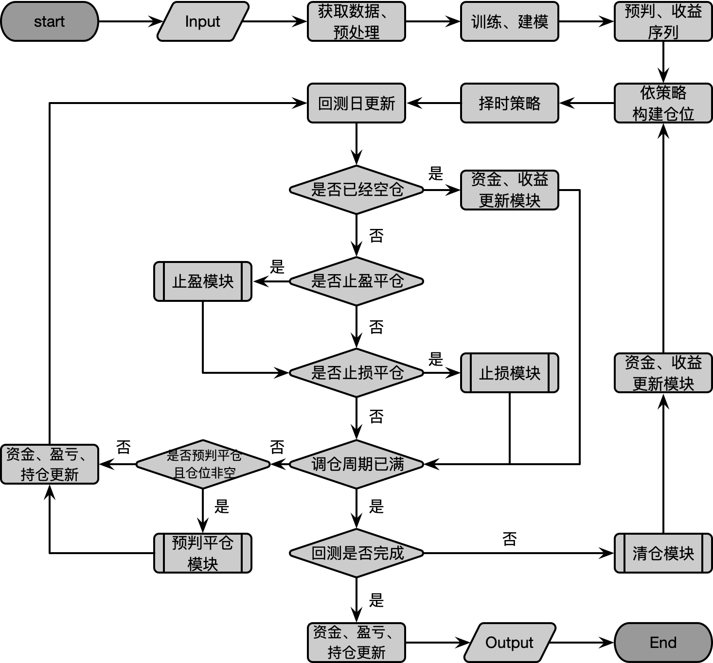

#### 输出评价

回测完成后，会对所有的回测情况进行评估。选取了$4$个经典评价量化策略的指标，分别是：

- 收益率
- 回撤率
- 夏普率及风险
- 信息比率及跟踪误差

这样既可以对回测效果有很好的刻画，又会在一定程度上杜绝过拟合的情形

**收益率**

这是我们最关心的，相当于是回测区间内的收益效率衡量

对于第$t$交易日的账户权益或者指数，收益率计算公式如下：

$R_t=\frac{P_t-P_0}{P_0},\qquad t=0,1,2,...,T$

```python
def Cal_Return_Rate(seq, yd=250):
    seqn = len(seq)
    Return_Rate = (seq[-1] / seq[0]) - 1
    Annual_Rate = math.pow((seq[-1] / seq[0]), yd / seqn) - 1
    Return_List = []
    Base_V = seq[0]
    for i in range(seqn):
        if i == 0:
            Return_List.append(float(0.00))
        else:
            ri = (float(seq[i]) - float(Base_V))/float(Base_V)
            Return_List.append(ri)
    return Return_Rate, Annual_Rate, Return_List
```

**最大回撤率**

指在回测区间内内任一历史时点往后推，资产（指数）走到最低点时的收益率回撤幅度的最大值

最大回撤用来描述实行投资组合建仓后（指数）可能出现的最糟糕的情况

最大回撤是一个重要的风险指标，对于对冲基金和数量化策略交易，该指标比波动率还重要

$P_i$为第$i$天的资产（指数），$P_j$则是$P_i$后面某一天的资产指数

则该资产（指数）在第$j$交易日以及整体的最大回撤率计算如下：

$Max_{drawdown}(j)=\frac{\max(P_i-P_j)}{P_i},\qquad i=0,1,2,...,T\quad j>i$

$Max_{drawdown}=\max\limits_j(Max_{drawdown}(j))\qquad j=1,2,...,T$

```python
def Cal_Withdrawal_Rate(seq):
    Wdl_Rate_List = []
    max_temp = 0
    for i in range(len(seq)):
        max_temp = max(max_temp, seq[i])
        Wdl_Rate = (max_temp - seq[i]) / max_temp
        Wdl_Rate_List.append(round(Wdl_Rate, 4))
    Max_Index = Wdl_Rate_List.index(max(Wdl_Rate_List))
    return max(Wdl_Rate_List), Max_Index, Wdl_Rate_List
```

**夏普率及风险**

夏普率代表投资组合（指数）对于波动风险的微分，既单位风险所获得的超额回报率（相当于无风险利率）

该比率越高，策略承担单位风险得到的超额回报率越高，公式为：

$Sharpe\_ratio= \frac{R_p-R_f}{\sigma_p}$

其中，$R_p$为区间收益率， $R_f$ 是区间无风险收益率，$\sigma_p$为区间波动率

注意，在主流的策略效果对比时，还是需要统一到年化来比较

```python
def Cal_Sharp_Rate(seq, Rf=0.015, yd=250):
    seqn = len(seq)
    seq_return = Cal_Return_Rate(seq)
    norisk_return = Rf * seqn / yd
    Risk = float(np.array(seq_return[2]).std())
    Sharp_Rate = (seq_return[0] - norisk_return) / Risk
    return Sharp_Rate, Risk
```

**信息比率及跟踪误差**

**跟踪误差**：投资组合与基准指数收益率差值的波动风险

主动投资组合策略可能会拥有较大的跟踪误差

被动复制指数策略通常拥有较小的跟踪误差

**信息比率**：代表投资组合与基准指数收益率差值对于跟踪误差的微分

既单位跟踪误差所获得的超额回报率（相对于基准指数）

该比率越高，策略承担单位跟踪误差得到的超额回报率越高，公式为：

$Information\_ratio=\frac{R_p-R_m}{\sigma_t}$

其中，$R_p$为区间收益率， $R_f$ 为区间基准收益率（如HS300 Idx），$\sigma_t$为策略与基准每日收益率差值的区间标准差

同样，在主流的策略效果对比时，还是需要统一到年化来比较

```python
def Cal_Info_Ratio(seq, seq_base):
    seq_return = Cal_Return_Rate(seq)
    seq_base_return = Cal_Return_Rate(seq_base)
    sigma = float((np.array(seq_return[2]) - np.array(seq_base_return[2])).std())
    ir = (seq_return[0] - seq_base_return[0]) / sigma
    return ir, sigma
```

#### 回测结果

 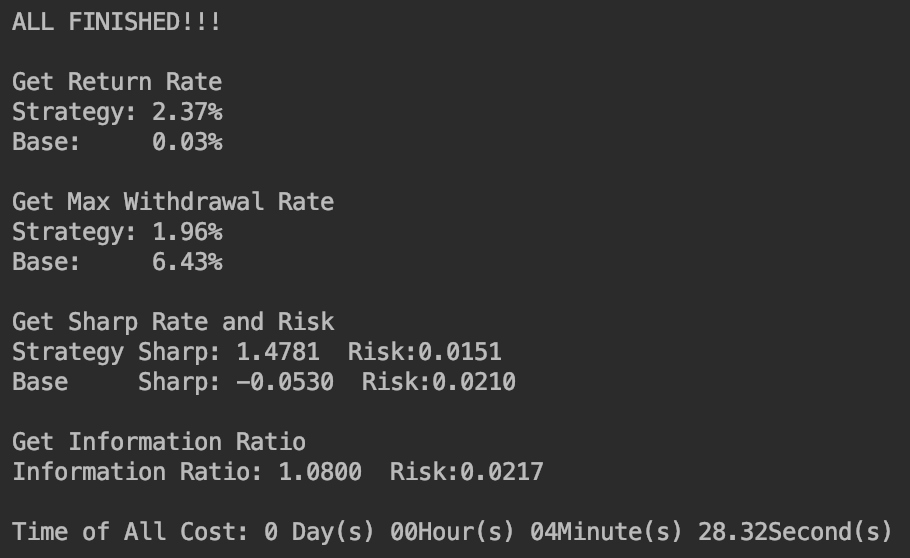

回测完成后，会返部部分前述的评价指标及运行时间（一个自然月的回测约需要$4\min$）

我们发现，投资组合的收益曲线**背离大盘**，在期末的收益率达到 $2.35\%$，明显跑赢市场的$0.03\%$

并且策略拥有较小的最大回撤率，以及较大的夏普率，甚至还降低了风险

我们发现跟踪误差略大于策略风险，说明我们的策略还是一个偏主动的策略

#### 资产信息

**资金变动情况**

 接下来再看这套投资组合的账单详情：

- 总计经历了$4$个完整的投资组合建立及平仓的周期，并且在第$5$个投资组合建立并部分平仓后，完成了回测
- 总计$12$次卖出操作，其中 $3$ 次止盈平仓，$4$ 次超时平仓，$1$ 次止损平仓，$4$ 次预测平仓
- 从收益情况来看，$12$次卖出操作中，$9$ 次盈利，$3$ 次亏损

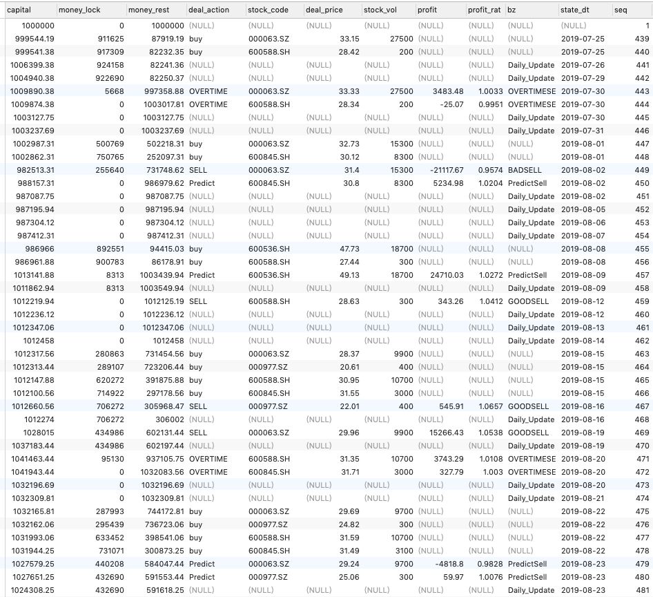

与纯市场方向相比，还是有适量的操作

并且事实上，止盈和止损次数均多于最小风险的投资组合（未展示）

从操作和收益来看也印证了“高风险高收益”的道理

**仍持仓标的**

 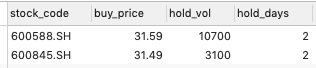

当然，还会返回回测时间到期时，已经建仓但还没有平仓的标的，在其他分析中不能遗漏

### Return，Withdrawal的可视化

程序还会返回回测过程中的收益率和（取负）回撤率曲线 <p align="left">

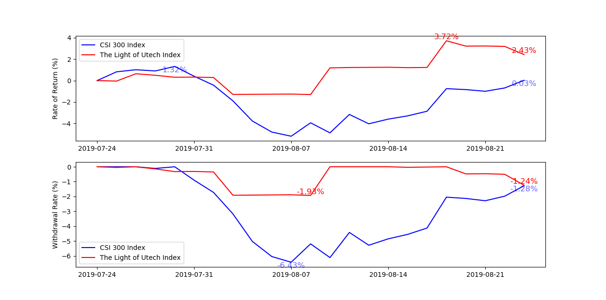

我们发现策略的收益率曲线整体在沪深300指数以上，说明我们的策略整体收益情况超过基准指数

并且整体的回测幅度也相对较小，说明我们的策略较为稳定，在大盘回撤时，没有出现更糟糕的情况（对于在A股市场经历过实盘交易的投资者来说，这一点显得尤为重要）


至此，**数据采集及建模**→**模型评估与仓位管理**→**构建投资组合与回测验证策略**的流程已经全部结束


【[**Return to Codes**](https://github.com/FDUJiaG/QT_Test/tree/master/codes)】

【[**Return to Repositories**](https://github.com/FDUJiaG/QT_Test)】